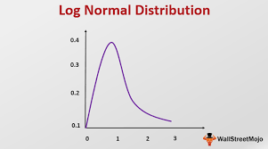
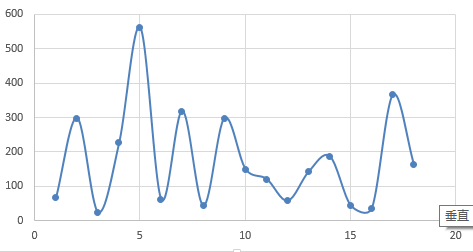
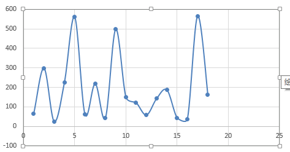
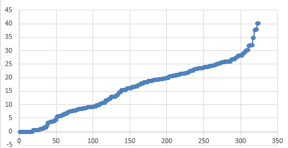
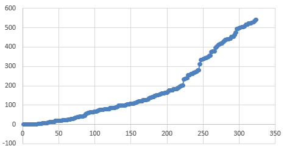

# K-means实验

## 一、概述

我们这个实验的目的是使用 K-means 算法来对节点进行归类。对 K-means 算法中节点之间距离的度量要素有：节点之间的网络延迟，节点之间的信用度差距。

设两个节点为 m 和 n，网络延迟的值记为 delay<sub>m, n</sub>，信用度差距的值 是 credit<sub>m, n</sub>，那么 **distence<sub>m, n</sub> = a * delay<sub>m, n</sub> + b * credit<sub>m, n</sub>**。其中 a 和 b 是权重。

下面分布进行 delay、credit、a 和 b 的确认。


## 二、节点间的网络延迟 delay

### 1. 说明

在第一版中我们使用了实际的 20 台机器，并通过脚本来获取节点之间的网络延迟。但是由于实际的机器和网络的问题，实验效果不是我们期望的典型的情况。

这里我们通过模拟，期望构造出最典型的场景：有 3 个中心节点，其他的节点相对均匀的围绕在这 3 个点周围，这里我们使用 5 个卫星点来围绕每个中心点。这也是区块链网络中典型的超级节点和普通节点的场景。


### 2. 实验方法

这里使用的模拟方法如下：

* 确定 3 个中心点，设为 N1、N2、N3。再确定三个点之间的距离。

  三个点确定一个三角形和一个平面。三个中心点之间的距离为随机值。但是需要满足形成三角形的条件：任意两条边之和大于第三条边。另外虽然不需要满足等边三角形，但是也不能三个角相差过大，也就是三条边的长度要接近，大致有个等边的概念，然后在上下浮动一点点。

  

* 每个中心点周围有 5 个卫星点。每个卫星点到自己的中心点的距离也是随机值。这个随机范围在 0 和 中心节点之间距离的一半。这是因为超过一半之后这个卫星点就会被划到另一个中心点的范围内。

  

* 每个中心点的 5 个卫星点，彼此之间的距离。

  举个例子，要求出 N1 的 2 个卫星点 A 和 B 之间的距离。

  在几何空间中想一下，N1 、A 、B 三个点在一条直线上或者构成一个三角形。A 和 B 之间的距离 Lab，满足[La1 - Lb1, La1 + Lb1]， 这里 La1 表示 A 到 N1 的距离，Lb1 也类似，这里假设 La1 > Lb1. 

  我们的取值方法是：在这个范围中取一个随机值。

  

* 确认卫星点到其他中心点的距离。

  举个例子，要求出 N1 的卫星节点 X 到 N2 的距离，记为 Lx2。

  在几何空间中设想一下，X、N1、N2 三个点要么在一条直线上，要么可以构成一个三角形，设 N1 到 N2 的距离是 L12，X 到 N1 的距离是 Lx1 ，那么 L<sub>12</sub> - Lx1  <=  Lx2 <= L12 + Lx1 。

  我们的取值方法为：用 L12 加或者减（随机的）上一个 Lx1 乘以系数，这个系数是一个 0到1之间的随机值。

  

* 确认不同中心节点的 2 个卫星节点之间的距离。

  举个例子，要求出 N1 的卫星节点 X 到 N2 的卫星节点 Y 之间的距离。可以在三维空间中设想出来，这个距离的范围是[L12 - Lx1 - Ly2,  L12 + Lx1 + Ly2]。

  我们的取值方法：L12 加或减（随机）一个系数乘以 Lx1 和 Ly2 的和，这个系数是 0 和 1 之间的随机值。


### 3. 实验步骤

#### 3.1 确定中心节点，以及之间的距离

选择三个节点，记为 N1、N2、N3.

根据我们的方法：先确定一个等边的长度，然后根据随机值上下浮动。

对我们上一版的实验结果进行简单的分析，得到下面这个频率表。可以看出 16ms 左右的网络延迟占绝大多数。

| 0.271    | 1    |
| -------- | ---- |
| 16.35745 | 181  |
| 32.4439  | 0    |
| 48.53035 | 80   |
| 64.6168  | 31   |
| 80.70325 | 25   |
| 96.7897  | 10   |
| 112.8762 | 0    |
| 128.9626 | 0    |
| 145.0491 | 0    |
| 161.1355 | 0    |
| 177.222  | 12   |
| 193.3084 | 6    |
| 209.3949 | 3    |
| 225.4813 | 14   |
| 241.5678 | 25   |
| 257.6542 | 6    |
| 273.7407 | 2    |
| 289.8271 | 0    |
| 305.9136 | 0    |

所以我们这里选择 20ms 作为等边的长度。

随机范围在 -5 ~ 5 之间

```python
import random
for i in range(3):
	print("%.2f" % (random.uniform(-5, 5)))
```

保留 2 位小数，得到

``` 
1.62
4.42
-0.69
```

所以 N1~~ N2 是 21.62， N1~~ N3 是 24.42， N2 ~~ N3 是 19.31.


#### 3.2 确定卫星节点到各自中心节点的距离

每个中心节点有 5 个卫星节点。

根据我们的方法：卫星节点到中心节点的距离的取值范围是 0 到 等边距离（20） 的一半，在这个区间取随机值。

```python
import random
for i in range(5):
	print("%.2f" % (random.uniform(0, 10)))
```

运行 3 次，保留 2 位小数，得到下面的数据

```
N1的卫星节点到 N1 的距离
0.57
7.74
9.18
1.01
0.76

N2 的卫星节点到 N2 的距离
3.63
0.68
6.12
8.61
3.84

N3 的卫星节点到 N3 的距离
9.17
2.22
9.85
8.51
1.12
```


#### 3.3 确定同一中心节点中卫星节点之间的距离

根据我们的方法：这个距离是取值范围[La1 - Lb1, La1 + Lb1] 之间的一个随机值。

使用下列代码来计算

```python
import random

l12 = 21.62
l13 = 24.42
l23 = 19.31

l1 = [0.57, 7.74, 9.18, 1.01, 0.76]
l2 = [3.63, 0.68, 6.12, 8.61, 3.84]
l3 = [9.17, 2.22, 9.85, 8.51, 1.12]


for i in range(5):
    for j in range(i+1, 5):
        print("%.2f" % (random.uniform(abs(l1[i] - l1[j]), l1[i] + l1[j])))
print


for i in range(5):
    for j in range(i+1, 5):
        print("%.2f" % (random.uniform(abs(l2[i] - l2[j]), l2[i] + l2[j])))
print

for i in range(5):
    for j in range(i+1, 5):
        print("%.2f" % (random.uniform(abs(l3[i] - l3[j]), l3[i] + l3[j])))
print
```


得到结果如下：

```
7.20
8.98
1.47
0.49
16.00
7.99
7.57
9.38
9.21
0.52

3.47
6.08
7.50
7.39
5.55
8.70
3.93
3.35
5.76
9.07

8.48
15.94
13.06
8.33
7.77
9.45
1.52
5.75
10.64
8.49
```


#### 3.4 确定卫星节点到其他中心节点的距离

根据我们的方法：这个距离是两个中心节点之间的距离加或减一个系数乘以卫星节点到中心节点之间的距离。

使用下列代码来计算

```python
import random

l12 = 21.62
l13 = 24.42
l23 = 19.31

l1 = [0.57, 7.74, 9.18, 1.01, 0.76]
l2 = [3.63, 0.68, 6.12, 8.61, 3.84]
l3 = [9.17, 2.22, 9.85, 8.51, 1.12]

# N1's stars to N2
for i in l1:
    print("%.2f" % (l12 + i* random.uniform(-1, 1)))
print

# N1's stars to N3
for i in l1:
    print("%.2f" % (l13 + i * random.uniform(-1, 1)))
print


# N2's stars to N1
for i in l2:
    print("%.2f" % (l12 + i* random.uniform(-1, 1)))
print

# N2's stars to N3
for i in l2:
    print("%.2f" % (l23 + i * random.uniform(-1, 1)))
print


# N3's stars to N1
for i in l3:
    print("%.2f" % (l13 + i* random.uniform(-1, 1)))

print

# N3's stars to N2
for i in l3:
    print("%.2f" % (l23 + i * random.uniform(-1, 1)))

```


得到下列数据

```
N1 的卫星节点到 N2
21.47
28.97
21.35
21.12
20.89

N1 的卫星节点到 N3
24.40
27.85
30.31
23.88
25.03

N2 的卫星节点到 N1
18.44
21.14
26.56
19.78
23.61

N2 的卫星节点到 N3
17.90
19.61
23.90
17.96
19.91

N3 的卫星节点到 N1
16.76
23.34
21.50
24.11
23.54

N3 的卫星节点到 N2
13.02
17.38
23.68
13.50
18.40
```


#### 3.4 确定卫星节点到卫星节点之间的距离

根据我们的方法：两个卫星节点之间的距离，等于两个中心节点之间的距离，加或减一个系数乘以两个卫星节点到各自中心节点距离的和。

使用下列代码计算：

```python
import random

l12 = 21.62
l13 = 24.42
l23 = 19.31

l1 = [0.57, 7.74, 9.18, 1.01, 0.76]
l2 = [3.63, 0.68, 6.12, 8.61, 3.84]
l3 = [9.17, 2.22, 9.85, 8.51, 1.12]


# N1's stars to N2's stars
for i in l1:
    for j in l2:
        print("%0.2f" % (l12 + (i+j) * random.uniform(-1, 1)))
    print
print
print


# N1's stars to N3's stars
for i in l1:
    for j in l3:
        print("%0.2f" % (l13 + (i+j) * random.uniform(-1, 1)))
    print
print
print


# N2's stars to N3's stars
for i in l2:
    for j in l3:
        print("%0.2f" % (l23 + (i+j) * random.uniform(-1, 1)))
    print
print
print

```

上面只需要 3 个循环就可以了，因为卫星节点到卫星节点之间的距离，两者是相等的。

得到下列结果：

```
N1 的第 1 个卫星节点到 N2 的所有卫星节点
18.79
22.33
28.24
20.79
23.40

N1 的第 2 个卫星节点到 N2 的所有卫星节点
10.47
19.58
11.97
17.15
12.21

N1 的第 3 个卫星节点到 N2 的所有卫星节点
16.17
25.17
6.62
37.80
15.45

N1 的第 4 个卫星节点到 N2 的所有卫星节点
25.82
20.50
15.36
21.77
21.49

N1 的第 5 个卫星节点到 N2 的所有卫星节点
19.21
22.96
18.89
22.72
20.42


N1 的第 1 个卫星节点到 N3 的所有卫星节点
18.78
25.77
25.47
15.34
26.08

N1 的第 2 个卫星节点到 N3 的所有卫星节点
11.71
32.15
16.72
40.13
26.01

N1 的第 3 个卫星节点到 N3 的所有卫星节点
11.66
26.84
12.99
34.76
30.03

N1 的第 4 个卫星节点到 N3 的所有卫星节点
29.29
23.51
19.49
19.35
24.02

N1 的第 5 个卫星节点到 N3 的所有卫星节点
31.77
22.22
26.90
28.28
26.02


N2 的第 1 个卫星节点到 N3 的所有卫星节点
18.24
22.64
19.38
27.24
14.79

N2 的第 2 个卫星节点到 N3 的所有卫星节点
10.25
16.57
28.24
10.80
20.63

N2 的第 3 个卫星节点到 N3 的所有卫星节点
4.48
16.02
14.44
26.07
25.23

N2 的第 4 个卫星节点到 N3 的所有卫星节点
9.90
24.59
37.70
6.67
13.57

N2 的第 5 个卫星节点到 N3 的所有卫星节点
32.04
24.70
16.57
19.08
19.81
```


### 4. 实验结果

将上面的实验结果进行整理，得到下面的矩阵：

N1、N2、N3 是三个中心节点。N12 表示 N1 的第二个卫星节点，其他类似。

|      | N1    | N2    | N3    | N11   | N12   | N13   | N14   | N15   | N21   | N22   | N23   | N24   | N25   | N31   | N32  | N33   | N34  | N35  |
| ---- | ----- | ----- | ----- | ----- | ----- | ----- | ----- | ----- | ----- | ----- | ----- | ----- | ----- | ----- | ---- | ----- | ---- | ---- |
| N1   | 0     |       |       |       |       |       |       |       |       |       |       |       |       |       |      |       |      |      |
| N2   | 21.62 | 0     |       |       |       |       |       |       |       |       |       |       |       |       |      |       |      |      |
| N3   | 24.42 | 19.31 | 0     |       |       |       |       |       |       |       |       |       |       |       |      |       |      |      |
| N11  | 0.57  | 21.47 | 24.4  | 0     |       |       |       |       |       |       |       |       |       |       |      |       |      |      |
| N12  | 7.74  | 28.97 | 27.85 | 7.2   | 0     |       |       |       |       |       |       |       |       |       |      |       |      |      |
| N13  | 9.18  | 21.35 | 30.31 | 8.98  | 16    | 0     |       |       |       |       |       |       |       |       |      |       |      |      |
| N14  | 1.01  | 21.12 | 23.88 | 1.47  | 7.99  | 9.38  | 0     |       |       |       |       |       |       |       |      |       |      |      |
| N15  | 0.76  | 20.89 | 25.03 | 0.49  | 7.57  | 9.21  | 0.52  | 0     |       |       |       |       |       |       |      |       |      |      |
| N21  | 18.44 | 3.63  | 17.9  | 18.79 | 10.47 | 16.17 | 25.82 | 19.21 | 0     |       |       |       |       |       |      |       |      |      |
| N22  | 21.14 | 0.68  | 19.61 | 22.33 | 19.58 | 25.17 | 20.5  | 22.96 | 3.47  | 0     |       |       |       |       |      |       |      |      |
| N23  | 26.56 | 6.12  | 23.9  | 28.24 | 11.97 | 6.62  | 15.36 | 18.89 | 6.08  | 5.55  | 0     |       |       |       |      |       |      |      |
| N24  | 19.78 | 8.61  | 17.96 | 20.79 | 17.15 | 37.8  | 21.77 | 22.72 | 7.5   | 8.7   | 3.35  | 0     |       |       |      |       |      |      |
| N25  | 23.61 | 3.84  | 19.91 | 23.4  | 12.21 | 15.45 | 21.49 | 20.42 | 7.39  | 3.93  | 5.76  | 9.07  | 0     |       |      |       |      |      |
| N31  | 16.76 | 13.02 | 9.17  | 18.78 | 11.71 | 11.66 | 29.29 | 31.77 | 18.24 | 10.25 | 4.48  | 9.9   | 32.04 | 0     |      |       |      |      |
| N32  | 23.34 | 17.38 | 2.22  | 25.77 | 32.15 | 26.84 | 23.51 | 22.22 | 22.64 | 16.57 | 16.02 | 24.59 | 24.7  | 8.48  | 0    |       |      |      |
| N33  | 21.5  | 23.68 | 9.85  | 25.47 | 16.72 | 12.99 | 19.49 | 26.9  | 19.38 | 28.24 | 14.44 | 37.7  | 16.57 | 15.94 | 7.77 | 0     |      |      |
| N34  | 24.11 | 13.5  | 8.51  | 15.34 | 40.13 | 34.76 | 19.35 | 28.28 | 27.24 | 10.8  | 26.07 | 6.67  | 19.08 | 13.06 | 9.45 | 5.75  | 0    |      |
| N35  | 23.54 | 18.4  | 1.12  | 26.08 | 26.01 | 30.03 | 24.02 | 26.02 | 14.79 | 20.63 | 25.23 | 13.57 | 19.81 | 8.33  | 1.52 | 10.64 | 8.49 | 0    |


翻转之后得到完整的矩阵：

|      | N1    | N2    | N3    | N11   | N12   | N13   | N14   | N15   | N21   | N22   | N23   | N24   | N25   | N31   | N32   | N33   | N34   | N35   |
| ---- | ----- | ----- | ----- | ----- | ----- | ----- | ----- | ----- | ----- | ----- | ----- | ----- | ----- | ----- | ----- | ----- | ----- | ----- |
| N1   | 0     | 21.62 | 24.42 | 0.57  | 7.74  | 9.18  | 1.01  | 0.76  | 18.44 | 21.14 | 26.56 | 19.78 | 23.61 | 16.76 | 23.34 | 21.5  | 24.11 | 23.54 |
| N2   | 21.62 | 0     | 19.31 | 21.47 | 28.97 | 21.35 | 21.12 | 20.89 | 3.63  | 0.68  | 6.12  | 8.61  | 3.84  | 13.02 | 17.38 | 23.68 | 13.5  | 18.4  |
| N3   | 24.42 | 19.31 | 0     | 24.4  | 27.85 | 30.31 | 23.88 | 25.03 | 17.9  | 19.61 | 23.9  | 17.96 | 19.91 | 9.17  | 2.22  | 9.85  | 8.51  | 1.12  |
| N11  | 0.57  | 21.47 | 24.4  | 0     | 7.2   | 8.98  | 1.47  | 0.49  | 18.79 | 22.33 | 28.24 | 20.79 | 23.4  | 18.78 | 25.77 | 25.47 | 15.34 | 26.08 |
| N12  | 7.74  | 28.97 | 27.85 | 7.2   | 0     | 16    | 7.99  | 7.57  | 10.47 | 19.58 | 11.97 | 17.15 | 12.21 | 11.71 | 32.15 | 16.72 | 40.13 | 26.01 |
| N13  | 9.18  | 21.35 | 30.31 | 8.98  | 16    | 0     | 9.38  | 9.21  | 16.17 | 25.17 | 6.62  | 37.8  | 15.45 | 11.66 | 26.84 | 12.99 | 34.76 | 30.03 |
| N14  | 1.01  | 21.12 | 23.88 | 1.47  | 7.99  | 9.38  | 0     | 0.52  | 25.82 | 20.5  | 15.36 | 21.77 | 21.49 | 29.29 | 23.51 | 19.49 | 19.35 | 24.02 |
| N15  | 0.76  | 20.89 | 25.03 | 0.49  | 7.57  | 9.21  | 0.52  | 0     | 19.21 | 22.96 | 18.89 | 22.72 | 20.42 | 31.77 | 22.22 | 26.9  | 28.28 | 26.02 |
| N21  | 18.44 | 3.63  | 17.9  | 18.79 | 10.47 | 16.17 | 25.82 | 19.21 | 0     | 3.47  | 6.08  | 7.5   | 7.39  | 18.24 | 22.64 | 19.38 | 27.24 | 14.79 |
| N22  | 21.14 | 0.68  | 19.61 | 22.33 | 19.58 | 25.17 | 20.5  | 22.96 | 3.47  | 0     | 5.55  | 8.7   | 3.93  | 10.25 | 16.57 | 28.24 | 10.8  | 20.63 |
| N23  | 26.56 | 6.12  | 23.9  | 28.24 | 11.97 | 6.62  | 15.36 | 18.89 | 6.08  | 5.55  | 0     | 3.35  | 5.76  | 4.48  | 16.02 | 14.44 | 26.07 | 25.23 |
| N24  | 19.78 | 8.61  | 17.96 | 20.79 | 17.15 | 37.8  | 21.77 | 22.72 | 7.5   | 8.7   | 3.35  | 0     | 9.07  | 9.9   | 24.59 | 37.7  | 6.67  | 13.57 |
| N25  | 23.61 | 3.84  | 19.91 | 23.4  | 12.21 | 15.45 | 21.49 | 20.42 | 7.39  | 3.93  | 5.76  | 9.07  | 0     | 32.04 | 24.7  | 16.57 | 19.08 | 19.81 |
| N31  | 16.76 | 13.02 | 9.17  | 18.78 | 11.71 | 11.66 | 29.29 | 31.77 | 18.24 | 10.25 | 4.48  | 9.9   | 32.04 | 0     | 8.48  | 15.94 | 13.06 | 8.33  |
| N32  | 23.34 | 17.38 | 2.22  | 25.77 | 32.15 | 26.84 | 23.51 | 22.22 | 22.64 | 16.57 | 16.02 | 24.59 | 24.7  | 8.48  | 0     | 7.77  | 9.45  | 1.52  |
| N33  | 21.5  | 23.68 | 9.85  | 25.47 | 16.72 | 12.99 | 19.49 | 26.9  | 19.38 | 28.24 | 14.44 | 37.7  | 16.57 | 15.94 | 7.77  | 0     | 5.75  | 10.64 |
| N34  | 24.11 | 13.5  | 8.51  | 15.34 | 40.13 | 34.76 | 19.35 | 28.28 | 27.24 | 10.8  | 26.07 | 6.67  | 19.08 | 13.06 | 9.45  | 5.75  | 0     | 8.49  |
| N35  | 23.54 | 18.4  | 1.12  | 26.08 | 26.01 | 30.03 | 24.02 | 26.02 | 14.79 | 20.63 | 25.23 | 13.57 | 19.81 | 8.33  | 1.52  | 10.64 | 8.49  | 0     |


## 二、信用度距离 credit

### 1. 说明

在第一版中，每个节点的信任值是随机生成的。而在我们设想的场景中，信用度的值是呈长尾分布的，也就是几个中心点的信用值为比较高，其他节点的信用值是比较低的。这里我们按照长尾分布的情况设置信用值，然后得到节点之间的信用度距离。


### 2. 实验方法

这里我们使用的方法是使用 python 的 numpy 库中的 lognormal 函数。lognormal 函数的分布如下图所示。




### 3. 实验步骤

#### 3.1 产生 20 个随机值

使用下面的 python 代码，得到 log normal 的20 个随机值

```
import numpy as np

lognormal = np.random.lognormal(5, 1, 28)
print lognormal
```

得到如下的数据：

| 65.94466 |
| -------- |
| 298.0372 |
| 24.01104 |
| 226.2917 |
| 560.7597 |
| 61.70917 |
| 318.769  |
| 43.38005 |
| 298.0334 |
| 149.6222 |
| 120.9705 |
| 57.50884 |
| 142.0531 |
| 186.7431 |
| 43.54798 |
| 36.02953 |
| 365.6706 |
| 162.4225 |


图如下：





#### 3.2 微调

上面的数据并不满足我们”三个点的值较高、其他点较低“的场景，进行微调，得到如下的数据：

| 65.94466 |
| -------- |
| 298.0372 |
| 24.01104 |
| 226.2917 |
| 560.7597 |
| 61.70917 |
| 218.769  |
| 43.38005 |
| 498.0334 |
| 149.6222 |
| 120.9705 |
| 57.50884 |
| 142.0531 |
| 186.7431 |
| 43.54798 |
| 36.02953 |
| 565.6706 |
| 162.4225 |




#### 3.3 配置节点

使用最高的三个点的数据分别作为 Node1 、Node2、Node3 的值，其他的随机分配。得到下面的表

| Node1  | 560.7597 |
| ------ | -------- |
| Node2  | 498.0334 |
| Node3  | 565.6706 |
| Node11 | 65.94466 |
| Node12 | 298.0372 |
| Node13 | 24.01104 |
| Node14 | 226.2917 |
| Node15 | 61.70917 |
| Node21 | 218.769  |
| Node22 | 43.38005 |
| Node23 | 149.6222 |
| Node24 | 120.9705 |
| Node25 | 57.50884 |
| Node31 | 142.0531 |
| Node32 | 186.7431 |
| Node33 | 43.54798 |
| Node34 | 36.02953 |
| Node35 | 162.4225 |

### 4. 实验结果

根据节点的信用值，得到每两个节点之间的信用度距离。

|        | Node1  | Node2  | Node3  | Node11 | Node12 | Node13 | Node14 | Node15 | Node21 | Node22 | Node23 | Node24 | Node25 | Node31 | Node32 | Node33 | Node34 | Node35 |
| ------ | ------ | ------ | ------ | ------ | ------ | ------ | ------ | ------ | ------ | ------ | ------ | ------ | ------ | ------ | ------ | ------ | ------ | ------ |
| Node1  | 0      | 62.73  | 4.91   | 494.82 | 262.72 | 536.75 | 334.47 | 499.05 | 341.99 | 517.38 | 411.14 | 439.79 | 503.25 | 418.71 | 374.02 | 517.21 | 524.73 | 398.34 |
| Node2  | 62.73  | 0      | 67.64  | 432.09 | 200    | 474.02 | 271.74 | 436.32 | 279.26 | 454.65 | 348.41 | 377.06 | 440.52 | 355.98 | 311.29 | 454.49 | 462    | 335.61 |
| Node3  | 4.91   | 67.64  | 0      | 499.73 | 267.63 | 541.66 | 339.38 | 503.96 | 346.9  | 522.29 | 416.05 | 444.7  | 508.16 | 423.62 | 378.93 | 522.12 | 529.64 | 403.25 |
| Node11 | 494.82 | 432.09 | 499.73 | 0      | 232.09 | 41.93  | 160.35 | 4.24   | 152.82 | 22.56  | 83.68  | 55.03  | 8.44   | 76.11  | 120.8  | 22.4   | 29.92  | 96.48  |
| Node12 | 262.72 | 200    | 267.63 | 232.09 | 0      | 274.03 | 71.75  | 236.33 | 79.27  | 254.66 | 148.41 | 177.07 | 240.53 | 155.98 | 111.29 | 254.49 | 262.01 | 135.61 |
| Node13 | 536.75 | 474.02 | 541.66 | 41.93  | 274.03 | 0      | 202.28 | 37.7   | 194.76 | 19.37  | 125.61 | 96.96  | 33.5   | 118.04 | 162.73 | 19.54  | 12.02  | 138.41 |
| Node14 | 334.47 | 271.74 | 339.38 | 160.35 | 71.75  | 202.28 | 0      | 164.58 | 7.52   | 182.91 | 76.67  | 105.32 | 168.78 | 84.24  | 39.55  | 182.74 | 190.26 | 63.87  |
| Node15 | 499.05 | 436.32 | 503.96 | 4.24   | 236.33 | 37.7   | 164.58 | 0      | 157.06 | 18.33  | 87.91  | 59.26  | 4.2    | 80.34  | 125.03 | 18.16  | 25.68  | 100.71 |
| Node21 | 341.99 | 279.26 | 346.9  | 152.82 | 79.27  | 194.76 | 7.52   | 157.06 | 0      | 175.39 | 69.15  | 97.8   | 161.26 | 76.72  | 32.03  | 175.22 | 182.74 | 56.35  |
| Node22 | 517.38 | 454.65 | 522.29 | 22.56  | 254.66 | 19.37  | 182.91 | 18.33  | 175.39 | 0      | 106.24 | 77.59  | 14.13  | 98.67  | 143.36 | 0.17   | 7.35   | 119.04 |
| Node23 | 411.14 | 348.41 | 416.05 | 83.68  | 148.41 | 125.61 | 76.67  | 87.91  | 69.15  | 106.24 | 0      | 28.65  | 92.11  | 7.57   | 37.12  | 106.07 | 113.59 | 12.8   |
| Node24 | 439.79 | 377.06 | 444.7  | 55.03  | 177.07 | 96.96  | 105.32 | 59.26  | 97.8   | 77.59  | 28.65  | 0      | 63.46  | 21.08  | 65.77  | 77.42  | 84.94  | 41.45  |
| Node25 | 503.25 | 440.52 | 508.16 | 8.44   | 240.53 | 33.5   | 168.78 | 4.2    | 161.26 | 14.13  | 92.11  | 63.46  | 0      | 84.54  | 129.23 | 13.96  | 21.48  | 104.91 |
| Node31 | 418.71 | 355.98 | 423.62 | 76.11  | 155.98 | 118.04 | 84.24  | 80.34  | 76.72  | 98.67  | 7.57   | 21.08  | 84.54  | 0      | 44.69  | 98.51  | 106.02 | 20.37  |
| Node32 | 374.02 | 311.29 | 378.93 | 120.8  | 111.29 | 162.73 | 39.55  | 125.03 | 32.03  | 143.36 | 37.12  | 65.77  | 129.23 | 44.69  | 0      | 143.2  | 150.71 | 24.32  |
| Node33 | 517.21 | 454.49 | 522.12 | 22.4   | 254.49 | 19.54  | 182.74 | 18.16  | 175.22 | 0.17   | 106.07 | 77.42  | 13.96  | 98.51  | 143.2  | 0      | 7.52   | 118.87 |
| Node34 | 524.73 | 462    | 529.64 | 29.92  | 262.01 | 12.02  | 190.26 | 25.68  | 182.74 | 7.35   | 113.59 | 84.94  | 21.48  | 106.02 | 150.71 | 7.52   | 0      | 126.39 |
| Node35 | 398.34 | 335.61 | 403.25 | 96.48  | 135.61 | 138.41 | 63.87  | 100.71 | 56.35  | 119.04 | 12.8   | 41.45  | 104.91 | 20.37  | 24.32  | 118.87 | 126.39 | 0      |

## 三、规一 delay 和 credit 数据

### 1 说明
我们需要对网络延迟距离和信用度距离进行规一化处理。先分析一下数据的分布，然后进行调整。


### 2 实验

下图是网络延迟距离的数据的分布情况：




下图是信用度差值的数据分布情况：




可以看出信用度差值的最大值大约是网络延迟数据的十倍左右，我们将它除以十。


### 3. 结果

信用度的矩阵变为下面的矩阵：

|        | Node1  | Node2  | Node3  | Node11 | Node12 | Node13 | Node14 | Node15 | Node21 | Node22 | Node23 | Node24 | Node25 | Node31 | Node32 | Node33 | Node34 | Node35 |
| ------ | ------ | ------ | ------ | ------ | ------ | ------ | ------ | ------ | ------ | ------ | ------ | ------ | ------ | ------ | ------ | ------ | ------ | ------ |
| Node1  | 0      | 6.273  | 0.491  | 49.482 | 26.272 | 53.675 | 33.447 | 49.905 | 34.199 | 51.738 | 41.114 | 43.979 | 50.325 | 41.871 | 37.402 | 51.721 | 52.473 | 39.834 |
| Node2  | 6.273  | 0      | 6.764  | 43.209 | 20     | 47.402 | 27.174 | 43.632 | 27.926 | 45.465 | 34.841 | 37.706 | 44.052 | 35.598 | 31.129 | 45.449 | 46.2   | 33.561 |
| Node3  | 0.491  | 6.764  | 0      | 49.973 | 26.763 | 54.166 | 33.938 | 50.396 | 34.69  | 52.229 | 41.605 | 44.47  | 50.816 | 42.362 | 37.893 | 52.212 | 52.964 | 40.325 |
| Node11 | 49.482 | 43.209 | 49.973 | 0      | 23.209 | 4.193  | 16.035 | 0.424  | 15.282 | 2.256  | 8.368  | 5.503  | 0.844  | 7.611  | 12.08  | 2.24   | 2.992  | 9.648  |
| Node12 | 26.272 | 20     | 26.763 | 23.209 | 0      | 27.403 | 7.175  | 23.633 | 7.927  | 25.466 | 14.841 | 17.707 | 24.053 | 15.598 | 11.129 | 25.449 | 26.201 | 13.561 |
| Node13 | 53.675 | 47.402 | 54.166 | 4.193  | 27.403 | 0      | 20.228 | 3.77   | 19.476 | 1.937  | 12.561 | 9.696  | 3.35   | 11.804 | 16.273 | 1.954  | 1.202  | 13.841 |
| Node14 | 33.447 | 27.174 | 33.938 | 16.035 | 7.175  | 20.228 | 0      | 16.458 | 0.752  | 18.291 | 7.667  | 10.532 | 16.878 | 8.424  | 3.955  | 18.274 | 19.026 | 6.387  |
| Node15 | 49.905 | 43.632 | 50.396 | 0.424  | 23.633 | 3.77   | 16.458 | 0      | 15.706 | 1.833  | 8.791  | 5.926  | 0.42   | 8.034  | 12.503 | 1.816  | 2.568  | 10.071 |
| Node21 | 34.199 | 27.926 | 34.69  | 15.282 | 7.927  | 19.476 | 0.752  | 15.706 | 0      | 17.539 | 6.915  | 9.78   | 16.126 | 7.672  | 3.203  | 17.522 | 18.274 | 5.635  |
| Node22 | 51.738 | 45.465 | 52.229 | 2.256  | 25.466 | 1.937  | 18.291 | 1.833  | 17.539 | 0      | 10.624 | 7.759  | 1.413  | 9.867  | 14.336 | 0.017  | 0.735  | 11.904 |
| Node23 | 41.114 | 34.841 | 41.605 | 8.368  | 14.841 | 12.561 | 7.667  | 8.791  | 6.915  | 10.624 | 0      | 2.865  | 9.211  | 0.757  | 3.712  | 10.607 | 11.359 | 1.28   |
| Node24 | 43.979 | 37.706 | 44.47  | 5.503  | 17.707 | 9.696  | 10.532 | 5.926  | 9.78   | 7.759  | 2.865  | 0      | 6.346  | 2.108  | 6.577  | 7.742  | 8.494  | 4.145  |
| Node25 | 50.325 | 44.052 | 50.816 | 0.844  | 24.053 | 3.35   | 16.878 | 0.42   | 16.126 | 1.413  | 9.211  | 6.346  | 0      | 8.454  | 12.923 | 1.396  | 2.148  | 10.491 |
| Node31 | 41.871 | 35.598 | 42.362 | 7.611  | 15.598 | 11.804 | 8.424  | 8.034  | 7.672  | 9.867  | 0.757  | 2.108  | 8.454  | 0      | 4.469  | 9.851  | 10.602 | 2.037  |
| Node32 | 37.402 | 31.129 | 37.893 | 12.08  | 11.129 | 16.273 | 3.955  | 12.503 | 3.203  | 14.336 | 3.712  | 6.577  | 12.923 | 4.469  | 0      | 14.32  | 15.071 | 2.432  |
| Node33 | 51.721 | 45.449 | 52.212 | 2.24   | 25.449 | 1.954  | 18.274 | 1.816  | 17.522 | 0.017  | 10.607 | 7.742  | 1.396  | 9.851  | 14.32  | 0      | 0.752  | 11.887 |
| Node34 | 52.473 | 46.2   | 52.964 | 2.992  | 26.201 | 1.202  | 19.026 | 2.568  | 18.274 | 0.735  | 11.359 | 8.494  | 2.148  | 10.602 | 15.071 | 0.752  | 0      | 12.639 |
| Node35 | 39.834 | 33.561 | 40.325 | 9.648  | 13.561 | 13.841 | 6.387  | 10.071 | 5.635  | 11.904 | 1.28   | 4.145  | 10.491 | 2.037  | 2.432  | 11.887 | 12.639 | 0      |


## 四、添加权重 a 和 b

### 1. 说明

我们按照三种情况来进行实验：

| a    | b    |
| ---- | ---- |
| 0.5  | 0.5  |
| 0.3  | 0.7  |
| 0.7  | 0.3  |


### 2. 结果

根据上面的三种情况，和计算式子 **distence<sub>m, n</sub> = a * delay<sub>m, n</sub> + b * credit<sub>m, n</sub>**， 得到三个矩阵

python 代码如下：

```python
delay = [
[ 0     , 21.62 , 24.42 , 0.57  , 7.74  , 9.18  , 1.01  , 0.76  , 18.44 , 21.14 , 26.56 , 19.78 , 23.61 , 16.76 , 23.34 , 21.5  , 24.11 , 23.54 ],
[ 21.62 , 0     , 19.31 , 21.47 , 28.97 , 21.35 , 21.12 , 20.89 , 3.63  , 0.68  , 6.12  , 8.61  , 3.84  , 13.02 , 17.38 , 23.68 , 13.5  , 18.4  ],
[ 24.42 , 19.31 , 0     , 24.4  , 27.85 , 30.31 , 23.88 , 25.03 , 17.9  , 19.61 , 23.9  , 17.96 , 19.91 , 9.17  , 2.22  , 9.85  , 8.51  , 1.12  ],
[ 0.57  , 21.47 , 24.4  , 0     , 7.2   , 8.98  , 1.47  , 0.49  , 18.79 , 22.33 , 28.24 , 20.79 , 23.4  , 18.78 , 25.77 , 25.47 , 15.34 , 26.08 ],
[ 7.74  , 28.97 , 27.85 , 7.2   , 0     , 16    , 7.99  , 7.57  , 10.47 , 19.58 , 11.97 , 17.15 , 12.21 , 11.71 , 32.15 , 16.72 , 40.13 , 26.01 ],
[ 9.18  , 21.35 , 30.31 , 8.98  , 16    , 0     , 9.38  , 9.21  , 16.17 , 25.17 , 6.62  , 37.8  , 15.45 , 11.66 , 26.84 , 12.99 , 34.76 , 30.03 ],
[ 1.01  , 21.12 , 23.88 , 1.47  , 7.99  , 9.38  , 0     , 0.52  , 25.82 , 20.5  , 15.36 , 21.77 , 21.49 , 29.29 , 23.51 , 19.49 , 19.35 , 24.02 ],
[ 0.76  , 20.89 , 25.03 , 0.49  , 7.57  , 9.21  , 0.52  , 0     , 19.21 , 22.96 , 18.89 , 22.72 , 20.42 , 31.77 , 22.22 , 26.9  , 28.28 , 26.02 ],
[ 18.44 , 3.63  , 17.9  , 18.79 , 10.47 , 16.17 , 25.82 , 19.21 , 0     , 3.47  , 6.08  , 7.5   , 7.39  , 18.24 , 22.64 , 19.38 , 27.24 , 14.79 ],
[ 21.14 , 0.68  , 19.61 , 22.33 , 19.58 , 25.17 , 20.5  , 22.96 , 3.47  , 0     , 5.55  , 8.7   , 3.93  , 10.25 , 16.57 , 28.24 , 10.8  , 20.63 ],
[ 26.56 , 6.12  , 23.9  , 28.24 , 11.97 , 6.62  , 15.36 , 18.89 , 6.08  , 5.55  , 0     , 3.35  , 5.76  , 4.48  , 16.02 , 14.44 , 26.07 , 25.23 ],
[ 19.78 , 8.61  , 17.96 , 20.79 , 17.15 , 37.8  , 21.77 , 22.72 , 7.5   , 8.7   , 3.35  , 0     , 9.07  , 9.9   , 24.59 , 37.7  , 6.67  , 13.57 ],
[ 23.61 , 3.84  , 19.91 , 23.4  , 12.21 , 15.45 , 21.49 , 20.42 , 7.39  , 3.93  , 5.76  , 9.07  , 0     , 32.04 , 24.7  , 16.57 , 19.08 , 19.81 ],
[ 16.76 , 13.02 , 9.17  , 18.78 , 11.71 , 11.66 , 29.29 , 31.77 , 18.24 , 10.25 , 4.48  , 9.9   , 32.04 , 0     , 8.48  , 15.94 , 13.06 , 8.33  ],
[ 23.34 , 17.38 , 2.22  , 25.77 , 32.15 , 26.84 , 23.51 , 22.22 , 22.64 , 16.57 , 16.02 , 24.59 , 24.7  , 8.48  , 0     , 7.77  , 9.45  , 1.52  ],
[ 21.5  , 23.68 , 9.85  , 25.47 , 16.72 , 12.99 , 19.49 , 26.9  , 19.38 , 28.24 , 14.44 , 37.7  , 16.57 , 15.94 , 7.77  , 0     , 5.75  , 10.64 ],
[ 24.11 , 13.5  , 8.51  , 15.34 , 40.13 , 34.76 , 19.35 , 28.28 , 27.24 , 10.8  , 26.07 , 6.67  , 19.08 , 13.06 , 9.45  , 5.75  , 0     , 8.49  ],
[ 23.54 , 18.4  , 1.12  , 26.08 , 26.01 , 30.03 , 24.02 , 26.02 , 14.79 , 20.63 , 25.23 , 13.57 , 19.81 , 8.33  , 1.52  , 10.64 , 8.49  , 0     ]]


credit = [
[0      , 6.273  , 0.491  , 49.482 , 26.272 , 53.675 , 33.447 , 49.905 , 34.199 , 51.738 , 41.114 , 43.979 , 50.325 , 41.871 , 37.402 , 51.721 , 52.473 , 39.834 ],
[6.273  , 0      , 6.764  , 43.209 , 20     , 47.402 , 27.174 , 43.632 , 27.926 , 45.465 , 34.841 , 37.706 , 44.052 , 35.598 , 31.129 , 45.449 , 46.2   , 33.561 ],
[0.491  , 6.764  , 0      , 49.973 , 26.763 , 54.166 , 33.938 , 50.396 , 34.69  , 52.229 , 41.605 , 44.47  , 50.816 , 42.362 , 37.893 , 52.212 , 52.964 , 40.325 ],
[49.482 , 43.209 , 49.973 , 0      , 23.209 , 4.193  , 16.035 , 0.424  , 15.282 , 2.256  , 8.368  , 5.503  , 0.844  , 7.611  , 12.08  , 2.24   , 2.992  , 9.648  ],
[26.272 , 20     , 26.763 , 23.209 , 0      , 27.403 , 7.175  , 23.633 , 7.927  , 25.466 , 14.841 , 17.707 , 24.053 , 15.598 , 11.129 , 25.449 , 26.201 , 13.561 ],
[53.675 , 47.402 , 54.166 , 4.193  , 27.403 , 0      , 20.228 , 3.77   , 19.476 , 1.937  , 12.561 , 9.696  , 3.35   , 11.804 , 16.273 , 1.954  , 1.202  , 13.841 ],
[33.447 , 27.174 , 33.938 , 16.035 , 7.175  , 20.228 , 0      , 16.458 , 0.752  , 18.291 , 7.667  , 10.532 , 16.878 , 8.424  , 3.955  , 18.274 , 19.026 , 6.387  ],
[49.905 , 43.632 , 50.396 , 0.424  , 23.633 , 3.77   , 16.458 , 0      , 15.706 , 1.833  , 8.791  , 5.926  , 0.42   , 8.034  , 12.503 , 1.816  , 2.568  , 10.071 ],
[34.199 , 27.926 , 34.69  , 15.282 , 7.927  , 19.476 , 0.752  , 15.706 , 0      , 17.539 , 6.915  , 9.78   , 16.126 , 7.672  , 3.203  , 17.522 , 18.274 , 5.635  ],
[51.738 , 45.465 , 52.229 , 2.256  , 25.466 , 1.937  , 18.291 , 1.833  , 17.539 , 0      , 10.624 , 7.759  , 1.413  , 9.867  , 14.336 , 0.017  , 0.735  , 11.904 ],
[41.114 , 34.841 , 41.605 , 8.368  , 14.841 , 12.561 , 7.667  , 8.791  , 6.915  , 10.624 , 0      , 2.865  , 9.211  , 0.757  , 3.712  , 10.607 , 11.359 , 1.28   ],
[43.979 , 37.706 , 44.47  , 5.503  , 17.707 , 9.696  , 10.532 , 5.926  , 9.78   , 7.759  , 2.865  , 0      , 6.346  , 2.108  , 6.577  , 7.742  , 8.494  , 4.145  ],
[50.325 , 44.052 , 50.816 , 0.844  , 24.053 , 3.35   , 16.878 , 0.42   , 16.126 , 1.413  , 9.211  , 6.346  , 0      , 8.454  , 12.923 , 1.396  , 2.148  , 10.491 ],
[41.871 , 35.598 , 42.362 , 7.611  , 15.598 , 11.804 , 8.424  , 8.034  , 7.672  , 9.867  , 0.757  , 2.108  , 8.454  , 0      , 4.469  , 9.851  , 10.602 , 2.037  ],
[37.402 , 31.129 , 37.893 , 12.08  , 11.129 , 16.273 , 3.955  , 12.503 , 3.203  , 14.336 , 3.712  , 6.577  , 12.923 , 4.469  , 0      , 14.32  , 15.071 , 2.432  ],
[51.721 , 45.449 , 52.212 , 2.24   , 25.449 , 1.954  , 18.274 , 1.816  , 17.522 , 0.017  , 10.607 , 7.742  , 1.396  , 9.851  , 14.32  , 0      , 0.752  , 11.887 ],
[52.473 , 46.2   , 52.964 , 2.992  , 26.201 , 1.202  , 19.026 , 2.568  , 18.274 , 0.735  , 11.359 , 8.494  , 2.148  , 10.602 , 15.071 , 0.752  , 0      , 12.639 ],
[39.834 , 33.561 , 40.325 , 9.648  , 13.561 , 13.841 , 6.387  , 10.071 , 5.635  , 11.904 , 1.28   , 4.145  , 10.491 , 2.037  , 2.432  , 11.887 , 12.639 , 0      ]]


a = 0.5
b = 0.5


result = []

length = len(credit)

for i in range(length):
    temp = []
    for j in range(length):
        temp.append(round(delay[i][j] * a + credit[i][j] * b, 2))
    result.append(temp)

print result
```


#### 2.1 第一种情况

结果如下：

[[0.0, 13.95, 12.46, 25.03, 17.01, 31.43, 17.23, 25.33, 26.32, 36.44, 33.84, 31.88, 36.97, 29.32, 30.37, 36.61, 38.29, 31.69], 
[13.95, 0.0, 13.04, 32.34, 24.48, 34.38, 24.15, 32.26, 15.78, 23.07, 20.48, 23.16, 23.95, 24.31, 24.25, 34.56, 29.85, 25.98], 
[12.46, 13.04, 0.0, 37.19, 27.31, 42.24, 28.91, 37.71, 26.29, 35.92, 32.75, 31.21, 35.36, 25.77, 20.06, 31.03, 30.74, 20.72], 
[25.03, 32.34, 37.19, 0.0, 15.2, 6.59, 8.75, 0.46, 17.04, 12.29, 18.3, 13.15, 12.12, 13.2, 18.93, 13.86, 9.17, 17.86], 
[17.01, 24.48, 27.31, 15.2, 0.0, 21.7, 7.58, 15.6, 9.2, 22.52, 13.41, 17.43, 18.13, 13.65, 21.64, 21.08, 33.17, 19.79], 
[31.43, 34.38, 42.24, 6.59, 21.7, 0.0, 14.8, 6.49, 17.82, 13.55, 9.59, 23.75, 9.4, 11.73, 21.56, 7.47, 17.98, 21.94], 
[17.23, 24.15, 28.91, 8.75, 7.58, 14.8, 0.0, 8.49, 13.29, 19.4, 11.51, 16.15, 19.18, 18.86, 13.73, 18.88, 19.19, 15.2], 
[25.33, 32.26, 37.71, 0.46, 15.6, 6.49, 8.49, 0.0, 17.46, 12.4, 13.84, 14.32, 10.42, 19.9, 17.36, 14.36, 15.42, 18.05], 
[26.32, 15.78, 26.29, 17.04, 9.2, 17.82, 13.29, 17.46, 0.0, 10.5, 6.5, 8.64, 11.76, 12.96, 12.92, 18.45, 22.76, 10.21], 
[36.44, 23.07, 35.92, 12.29, 22.52, 13.55, 19.4, 12.4, 10.5, 0.0, 8.09, 8.23, 2.67, 10.06, 15.45, 14.13, 5.77, 16.27], 
[33.84, 20.48, 32.75, 18.3, 13.41, 9.59, 11.51, 13.84, 6.5, 8.09, 0.0, 3.11, 7.49, 2.62, 9.87, 12.52, 18.71, 13.26],
 [31.88, 23.16, 31.21, 13.15, 17.43, 23.75, 16.15, 14.32, 8.64, 8.23, 3.11, 0.0, 7.71, 6.0, 15.58, 22.72, 7.58, 8.86], 
 [36.97, 23.95, 35.36, 12.12, 18.13, 9.4, 19.18, 10.42, 11.76, 2.67, 7.49, 7.71, 0.0, 20.25, 18.81, 8.98, 10.61, 15.15], 
 [29.32, 24.31, 25.77, 13.2, 13.65, 11.73, 18.86, 19.9, 12.96, 10.06, 2.62, 6.0, 20.25, 0.0, 6.47, 12.9, 11.83, 5.18], 
 [30.37, 24.25, 20.06, 18.93, 21.64, 21.56, 13.73, 17.36, 12.92, 15.45, 9.87, 15.58, 18.81, 6.47, 0.0, 11.04, 12.26, 1.98],
 [36.61, 34.56, 31.03, 13.86, 21.08, 7.47, 18.88, 14.36, 18.45, 14.13, 12.52, 22.72, 8.98, 12.9, 11.04, 0.0, 3.25, 11.26], 
 [38.29, 29.85, 30.74, 9.17, 33.17, 17.98, 19.19, 15.42, 22.76, 5.77, 18.71, 7.58, 10.61, 11.83, 12.26, 3.25, 0.0, 10.56], 
 [31.69, 25.98, 20.72, 17.86, 19.79, 21.94, 15.2, 18.05, 10.21, 16.27, 13.26, 8.86, 15.15, 5.18, 1.98, 11.26, 10.56, 0.0]]


#### 2.2 第二种情况


## 五、K-means 分组实验

### 1. 算法实现

下面是我实现的 k-means 算法

```python
import random

distence = [
[0.0, 13.95, 12.46, 25.03, 17.01, 31.43, 17.23, 25.33, 26.32, 36.44, 33.84, 31.88, 36.97, 29.32, 30.37, 36.61, 38.29, 31.69], 
[13.95, 0.0, 13.04, 32.34, 24.48, 34.38, 24.15, 32.26, 15.78, 23.07, 20.48, 23.16, 23.95, 24.31, 24.25, 34.56, 29.85, 25.98], 
[12.46, 13.04, 0.0, 37.19, 27.31, 42.24, 28.91, 37.71, 26.29, 35.92, 32.75, 31.21, 35.36, 25.77, 20.06, 31.03, 30.74, 20.72], 
[25.03, 32.34, 37.19, 0.0, 15.2, 6.59, 8.75, 0.46, 17.04, 12.29, 18.3, 13.15, 12.12, 13.2, 18.93, 13.86, 9.17, 17.86], 
[17.01, 24.48, 27.31, 15.2, 0.0, 21.7, 7.58, 15.6, 9.2, 22.52, 13.41, 17.43, 18.13, 13.65, 21.64, 21.08, 33.17, 19.79], 
[31.43, 34.38, 42.24, 6.59, 21.7, 0.0, 14.8, 6.49, 17.82, 13.55, 9.59, 23.75, 9.4, 11.73, 21.56, 7.47, 17.98, 21.94], 
[17.23, 24.15, 28.91, 8.75, 7.58, 14.8, 0.0, 8.49, 13.29, 19.4, 11.51, 16.15, 19.18, 18.86, 13.73, 18.88, 19.19, 15.2], 
[25.33, 32.26, 37.71, 0.46, 15.6, 6.49, 8.49, 0.0, 17.46, 12.4, 13.84, 14.32, 10.42, 19.9, 17.36, 14.36, 15.42, 18.05], 
[26.32, 15.78, 26.29, 17.04, 9.2, 17.82, 13.29, 17.46, 0.0, 10.5, 6.5, 8.64, 11.76, 12.96, 12.92, 18.45, 22.76, 10.21], 
[36.44, 23.07, 35.92, 12.29, 22.52, 13.55, 19.4, 12.4, 10.5, 0.0, 8.09, 8.23, 2.67, 10.06, 15.45, 14.13, 5.77, 16.27], 
[33.84, 20.48, 32.75, 18.3, 13.41, 9.59, 11.51, 13.84, 6.5, 8.09, 0.0, 3.11, 7.49, 2.62, 9.87, 12.52, 18.71, 13.26],
[31.88, 23.16, 31.21, 13.15, 17.43, 23.75, 16.15, 14.32, 8.64, 8.23, 3.11, 0.0, 7.71, 6.0, 15.58, 22.72, 7.58, 8.86], 
[36.97, 23.95, 35.36, 12.12, 18.13, 9.4, 19.18, 10.42, 11.76, 2.67, 7.49, 7.71, 0.0, 20.25, 18.81, 8.98, 10.61, 15.15], 
[29.32, 24.31, 25.77, 13.2, 13.65, 11.73, 18.86, 19.9, 12.96, 10.06, 2.62, 6.0, 20.25, 0.0, 6.47, 12.9, 11.83, 5.18], 
[30.37, 24.25, 20.06, 18.93, 21.64, 21.56, 13.73, 17.36, 12.92, 15.45, 9.87, 15.58, 18.81, 6.47, 0.0, 11.04, 12.26, 1.98],
[36.61, 34.56, 31.03, 13.86, 21.08, 7.47, 18.88, 14.36, 18.45, 14.13, 12.52, 22.72, 8.98, 12.9, 11.04, 0.0, 3.25, 11.26], 
[38.29, 29.85, 30.74, 9.17, 33.17, 17.98, 19.19, 15.42, 22.76, 5.77, 18.71, 7.58, 10.61, 11.83, 12.26, 3.25, 0.0, 10.56], 
[31.69, 25.98, 20.72, 17.86, 19.79, 21.94, 15.2, 18.05, 10.21, 16.27, 13.26, 8.86, 15.15, 5.18, 1.98, 11.26, 10.56, 0.0]]

nodes_num = 18

# get 3 random
centers = [random.randint(0,nodes_num-1) for _ in range(3)]
print "initial centers = ", centers

# clusters
clusters = [[], [], []]

def get_cluster(node):
    distence0 = distence[centers[0]][node]
    distence1 = distence[centers[1]][node]
    distence2 = distence[centers[2]][node]
    if distence0 < distence1 and distence0 < distence2:
        return 0
    elif distence1 < distence0 and distence1 < distence2:
        return 1
    else:
        return 2

def get_center(cluster):
    min_distences = float('inf')
    ret = cluster[0]

    for i in cluster:
        temp = 0
        # get all distence
        for j in cluster:
            temp += distence[i][j]
        if temp < min_distences:
            ret = i
            min_distences = temp

    return ret

def check_same(new_center0, new_center1, new_center2):
    if new_center0 in centers and new_center1 in centers and new_center2 in centers:
        return True


while True:
    for i in range(nodes_num):
        print "node ", i,
        cluster_id = get_cluster(i)
        print cluster_id
        clusters[cluster_id].append(i)

    print "clusters = ", clusters

    new_center0 = get_center(clusters[0])
    new_center1 = get_center(clusters[1])
    new_center2 = get_center(clusters[2])
    print "new centers = ", new_center0, new_center1, new_center2
    
    if check_same(new_center0, new_center1, new_center2):
        break
    else:
        clusters = [[], [], []]
        centers = [new_center0, new_center1, new_center2]
        

```

### 2. 说明

方法描述如下：

1. 先随机获取三个初始质点
2. 根据这三个质点，将所有的点分簇，方法是选择距离最近的质点
3. 在三个簇中重新选取质点，方法是选择这个簇中某个点，这个点到其他所有点的总距离最小。（不知道这个方法是否正确？）
4. 然后重复2、3，直到质点不发生变化


### 3. 结果

实验结果有个奇怪的地方，就是每次允许，都有可能得到三个不同的簇。